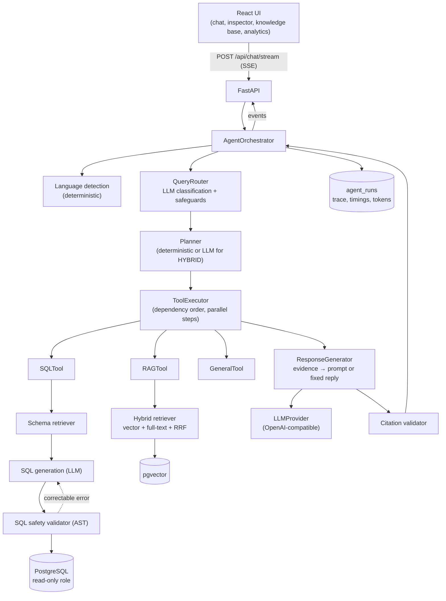
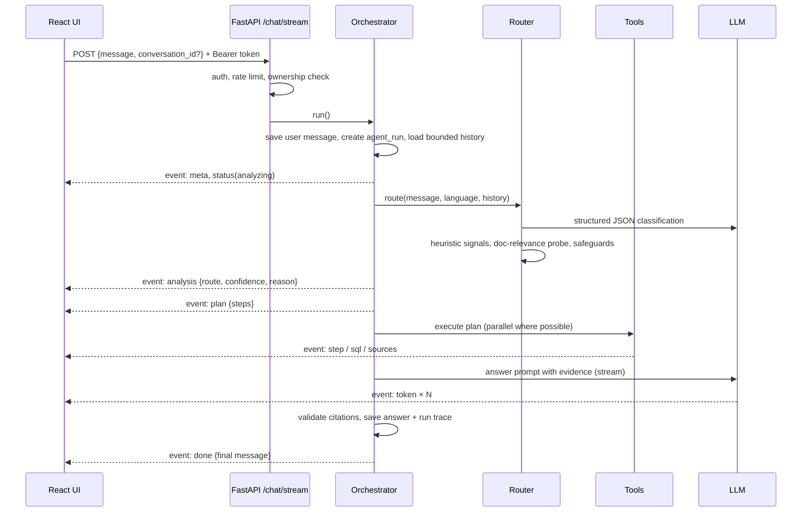
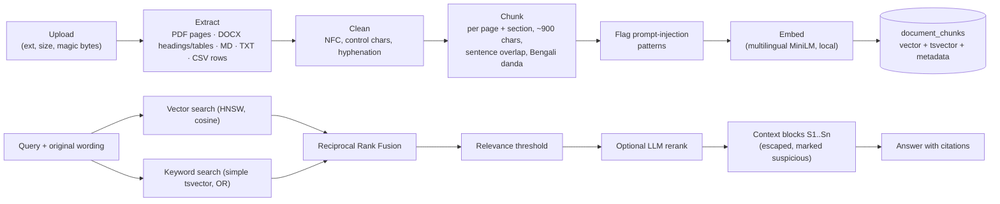
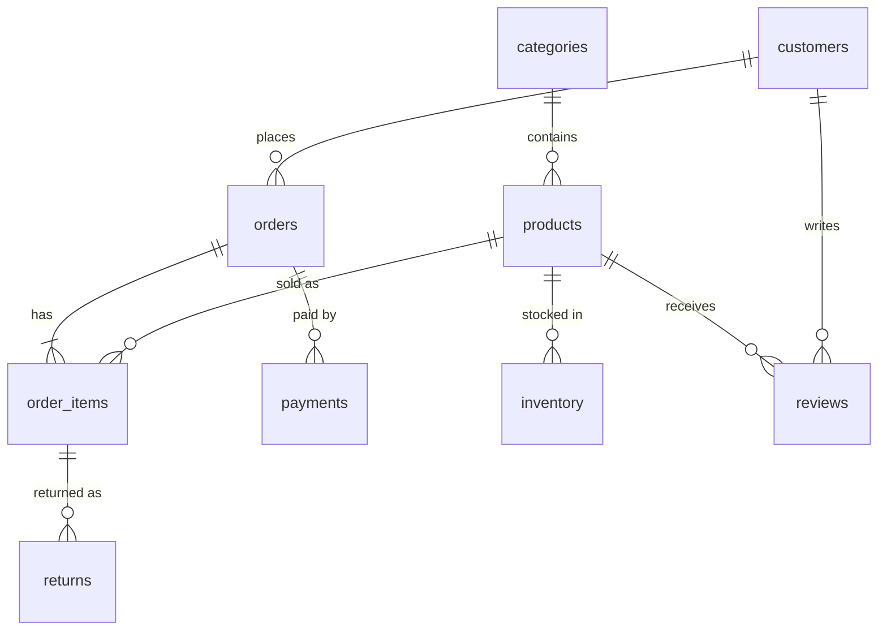

# NexaAI Agent

A multilingual business AI agent that answers questions in **English, Bengali, Banglish and mixed
Bengali–English** by choosing the right source of truth for each question:

| Question | Route | Source of truth |
|---|---|---|
| "How many orders were placed last month?" | **SQL** | PostgreSQL (Text-to-SQL) |
| "আমাদের return policy কী?" | **RAG** | Company documents (pgvector) |
| "Which product had the most returns, and what does our return policy say about it?" | **HYBRID** | Database + documents |
| "Explain what a database index is." | **GENERAL** | Language model knowledge |

The agent never sends every question blindly to a language model. It detects the language, routes
the request, plans tool calls, runs a **safety-checked, read-only** SQL query and/or a **hybrid
vector + keyword** document search, validates the evidence, and streams a grounded answer with
citations (`[DB1]`, `[S1]`), the generated SQL and an execution trace.

---

## Contents

- [Core features](#core-features)
- [Architecture](#architecture)
- [Request flow](#request-flow)
- [Text-to-SQL flow](#text-to-sql-flow)
- [RAG flow](#rag-flow)
- [Hybrid flow](#hybrid-flow)
- [Database schema](#database-schema)
- [API overview](#api-overview)
- [Technology stack](#technology-stack)
- [Setup](#setup) · [Environment variables](#environment-variables) · [Docker](#running-with-docker) · [Tests](#running-tests) · [Evaluation](#evaluation)
- [Security considerations](#security-considerations)
- [Future improvements](#future-improvements)

Further reading: [docs/architecture.md](docs/architecture.md) (design decisions),
[docs/developer-guide.md](docs/developer-guide.md) (file-by-file walkthrough),
[docs/api-contract.md](docs/api-contract.md) (API and SSE event contract).

---

## Core features

- **Intelligent routing:** structured LLM classification combined with deterministic safeguards:
  multilingual keyword signals, a document-relevance probe, tool availability, and
  conversation-aware follow-up handling. If the LLM is unavailable, the router falls back to
  heuristics.
- **Text-to-SQL:**
  - schema retrieval: only the relevant tables are sent to the model, and join tables are added automatically;
  - SQL generation with few-shot patterns;
  - an AST-based safety validator;
  - execution through a read-only database role with a timeout;
  - bounded self-correction.
- **RAG:**
  - PDF, DOCX, TXT, Markdown and CSV ingestion;
  - section- and page-aware chunking;
  - local multilingual embeddings, so no API key is needed;
  - pgvector HNSW search fused with PostgreSQL full-text search;
  - a relevance threshold and an optional LLM reranker;
  - validated citations.
- **Hybrid reasoning:** an LLM planner decomposes the question into dependent tool steps, for
  example "top category" then "warranty policy for {s1}". Independent steps run in parallel.
- **Multilingual:** deterministic detection of `en`, `bn`, `banglish` and `mixed`. Answers come back
  in the user's language style, and Bengali questions retrieve English documents cross-lingually.
- **Grounding and honesty:** if no relevant passages or rows exist, the agent replies with a fixed
  "couldn't find" message instead of asking the model. Fabricated citations are removed and
  flagged.
- **Streaming UX:** SSE events for each stage (`analysis`, `plan`, `step`, `sql`, `sources`,
  `token`, `done`). The React UI shows live tool activity, a collapsible SQL view, result tables,
  citation badges and an inspector panel.
- **Observability:** every run records language, route, confidence, tools, per-stage timings,
  token usage and error codes. Prompts and private reasoning are not stored. An analytics page
  shows the runs.
- **Security:** JWT authentication, admin/user roles, ownership checks, rate limiting,
  upload validation, prompt-injection isolation, secret redaction in logs, and security headers.
- **Evaluation:** an 80-question dataset plus a held-out set, with a runner that measures routing,
  SQL execution accuracy, retrieval, citations, answer facts and latency.

## Architecture



The orchestrator only **sequences** components. Each stage is a separate class behind a small
interface: `LLMProvider`, `EmbeddingProvider` and `BaseTool`. A new tool (a web search or a
calculator, say) is added by writing one class and registering it. See
[How to add a tool](docs/developer-guide.md#how-to-add-a-new-tool).

## Request flow



## Text-to-SQL flow

1. **Schema inspection** (`app/sql/catalog.py`): tables, columns, primary and foreign keys,
   indexes and `COMMENT`s are read from `pg_catalog`. The descriptions are written on the ORM
   models and applied as database comments by migrations, so the database documents itself.
2. **Schema retrieval** (`app/sql/schema_retriever.py`): tables are scored by multilingual keyword
   hits plus embedding similarity against table "cards". The top tables are then expanded along
   the shortest foreign-key path; customers plus products, for instance, pulls in orders and
   order_items.
3. **Generation** (`app/prompts/sql.py`): rules (revenue definition, date semantics for "last month"
   and "গত মাসে"), few-shot patterns and the current date. The model returns
   `{"sql", "explanation"}` and may return `sql: null` for unanswerable questions.
4. **Validation** (`app/sql/validator.py`): the query is parsed with sqlglot and checked. It must
   be a single SELECT, CTE or set operation. DML, DDL, `SELECT INTO`, locking, COPY and SET are
   rejected. Tables must come from an allowlist inside `commerce` (no `pg_catalog`,
   `information_schema` or app tables). Dangerous functions (`pg_sleep`, `pg_read_file`,
   `set_config`, `dblink`…) are blocked, columns must exist, and `LIMIT` is capped. Only the
   re-rendered, comment-free SQL is executed.
5. **Execution** (`app/sql/executor.py`): runs as the `nexa_readonly` role inside a
   `READ ONLY` transaction, with `SET LOCAL statement_timeout` and a cursor that fetches at most
   `max_rows + 1` rows (the extra row detects truncation).
6. **Self-correction** (`app/sql/service.py`): schema, syntax and database errors are fed back to the
   model. This happens at most `SQL_MAX_CORRECTION_ATTEMPTS` times, and only for correctable
   errors; unsafe SQL is never retried.
7. **Answering**: rows go into a `<database_result>` block. The model explains them and cites `[DB1]`.

## RAG flow



Each chunk stores `document_id`, `filename`, `page`, `section`, `chunk_index`, `source_type` and
`created_at`, plus injection markers. If nothing passes the relevance threshold, the agent says it
could not find the information and makes no LLM call.

## Hybrid flow

For a question such as *"গত বছরের সবচেয়ে বেশি বিক্রি হওয়া product কোনটি এবং এর warranty policy কী?"*:

1. The router returns `HYBRID` with an English `database_question` and `document_question`.
2. The planner (LLM, validated) produces:
   - `s1 sql`: find the top-selling product last year;
   - `s2 rag`: the warranty policy for `{s1}`, which depends on s1.
3. The executor runs `s1`. The top-row labels (for example "Walton Refrigerator 380L") are
   substituted into `s2`'s query, then `s2` runs.
4. The response generator builds one prompt containing both the `<database_result id="DB1">` and
   the `<document id="S1…">` blocks, and asks for a Bengali answer citing both.
5. If one side has no evidence, the answer says which part is missing. It never guesses.

If planning fails, a deterministic `sql → rag` plan is used instead.

## Database schema

Business data lives in the **`commerce`** schema, which is the only schema the SQL role can read.
Application data lives in `public`.



| Schema | Tables |
|---|---|
| `commerce` | categories (10), products (220), customers (300), orders (950), order_items (~2,050), payments (~990), inventory (~490), returns (~120), reviews (~580) |
| `public` | users, conversations, messages, documents, document_chunks (`vector(384)` + `tsvector`), agent_runs |

The seed data is synthetic, generated from a fixed random seed. Dates are relative to the seed
day, so "last month" always has data. Membership tiers follow the thresholds in the membership
policy document.

## API overview

| Endpoint | Purpose |
|---|---|
| `POST /api/auth/login`, `POST /api/auth/register`, `GET /api/auth/me` | JWT authentication |
| `POST /api/chat/stream` | Streaming agent answer (SSE) |
| `POST /api/chat` | Non-streaming agent answer |
| `GET/PATCH/DELETE /api/conversations[/{id}]` | Conversation history (owner only) |
| `POST/GET/DELETE /api/documents`, `POST /api/documents/{id}/reindex`, `GET /api/documents/{id}/chunks` | Knowledge-base admin |
| `GET /api/knowledge/search` | Hybrid document search |
| `GET /api/schema`, `GET /api/schema/tables` | Database schema browser (admin) |
| `GET /api/agent/runs[/{id}]`, `GET /api/agent/stats` | Observability |
| `GET /api/health`, `GET /api/system/info` | Health and configuration |

Interactive docs are served at `http://localhost:8000/api/docs` outside production. The full
contract, including every SSE event, is in [docs/api-contract.md](docs/api-contract.md).

## Technology stack

| Layer | Technology |
|---|---|
| Frontend | React 19, TypeScript (strict), Vite, Tailwind CSS v4, TanStack Query, React Router, react-markdown |
| Backend | Python 3.12, FastAPI, Pydantic v2, SQLAlchemy 2 (async), asyncpg, Alembic |
| Data | PostgreSQL 16 + pgvector (HNSW), PostgreSQL full-text search |
| AI | Provider-agnostic `LLMProvider` (any OpenAI-compatible API: OpenAI, Groq, Gemini, OpenRouter, Ollama…); `EmbeddingProvider` (local fastembed or OpenAI-compatible) |
| SQL safety | sqlglot AST validation + read-only role |
| Documents | pypdf, python-docx |
| Quality | pytest (+ integration tests on real Postgres), Vitest + Testing Library, ruff, ESLint, Prettier |
| Infra | Docker Compose (postgres, backend, frontend/nginx, optional Ollama) |

## Setup

**Prerequisites:** Docker, plus Python 3.12 with [uv](https://docs.astral.sh/uv/) and Node 22+
for local development.

```bash
cp .env.example .env           # then set JWT_SECRET, SQL_READONLY_PASSWORD and an LLM
```

Pick an LLM by setting `LLM_BASE_URL`, `LLM_MODEL` and `LLM_API_KEY`. `.env.example` lists
presets for OpenAI, Groq, Gemini, OpenRouter and Ollama. To run fully locally:

```bash
docker compose --profile local-llm up -d ollama
docker compose exec ollama ollama pull qwen2.5:7b-instruct
# LLM_BASE_URL=http://ollama:11434/v1 (inside compose) and LLM_MODEL=qwen2.5:7b-instruct
```

**Local development (hot reload):**

```bash
make install          # or: ./tasks.ps1 install   (Windows)
make dev              # Postgres in Docker; backend on :8000 and frontend on :5173
make seed             # demo database + knowledge base (idempotent)
```

Log in with `ADMIN_EMAIL` / `ADMIN_PASSWORD` from `.env` (default `admin@nexa.local` /
`ChangeMe123!`), or register a regular account.

## Environment variables

| Variable | Default | Description |
|---|---|---|
| `DATABASE_URL` | `postgresql+asyncpg://nexa:…@localhost:5434/nexa` | Application database (async URL) |
| `SQL_READONLY_USER` / `SQL_READONLY_PASSWORD` | `nexa_readonly` / – | Role created by migrations; SELECT on `commerce` only |
| `JWT_SECRET` | – | **Required in production** (≥ 32 chars) |
| `JWT_EXPIRE_MINUTES` | `720` | Access token lifetime |
| `ADMIN_EMAIL` / `ADMIN_PASSWORD` | – | Bootstrap administrator (password must be changed in production) |
| `ALLOW_REGISTRATION` | `true` | Allow self-service `user` accounts |
| `CORS_ORIGINS` | `http://localhost:5173,http://localhost:3000` | Allowed browser origins |
| `LLM_PROVIDER` | `openai_compatible` | `openai_compatible` or `none` |
| `LLM_BASE_URL` / `LLM_MODEL` / `LLM_API_KEY` | OpenAI / `gpt-4o-mini` / – | Chat completions endpoint |
| `LLM_TEMPERATURE`, `LLM_MAX_TOKENS`, `LLM_TIMEOUT_SECONDS`, `LLM_JSON_MODE` | `0.1`, `1200`, `60`, `true` | Generation settings |
| `EMBEDDING_PROVIDER` / `EMBEDDING_MODEL` / `EMBEDDING_DIMENSION` | `fastembed` / multilingual MiniLM / `384` | Embeddings; the dimension must match the model |
| `SQL_STATEMENT_TIMEOUT_MS`, `SQL_MAX_ROWS`, `SQL_MAX_CORRECTION_ATTEMPTS` | `5000`, `200`, `2` | SQL resource limits |
| `RAG_TOP_K`, `RAG_MIN_SIMILARITY`, `RAG_CHUNK_SIZE`, `RAG_CHUNK_OVERLAP`, `RAG_RERANKER` | `5`, `0.30`, `900`, `150`, `none` | Retrieval tuning |
| `MAX_UPLOAD_MB` | `10` | Upload size limit |
| `ROUTER_CLARIFY_THRESHOLD`, `CONTEXT_MAX_MESSAGES` | `0.40`, `8` | Clarification threshold; history window |
| `RATE_LIMIT_CHAT_PER_MINUTE`, `RATE_LIMIT_AUTH_PER_MINUTE`, `RATE_LIMIT_UPLOAD_PER_MINUTE` | `20`, `10`, `10` | Per-user / per-IP limits |
| `SEED_ON_STARTUP` | `true` in compose | Seed demo data when the backend container starts |

## Running with Docker

```bash
cp .env.example .env    # set secrets + LLM
docker compose up --build -d          # or: make up / ./tasks.ps1 up
```

| Service | URL |
|---|---|
| Web app (nginx → React, proxies `/api`) | http://localhost:3000 |
| Backend API / OpenAPI docs | http://localhost:8000/api/docs |
| PostgreSQL + pgvector | localhost:5434 |

On start, the backend waits for Postgres, applies migrations (which creates the read-only role),
seeds the demo data and knowledge base, and starts uvicorn. The first start downloads the
~220 MB embedding model into the `backend_data` volume.

## Running tests

```bash
make test             # or: ./tasks.ps1 test
make coverage         # backend coverage report
make lint
```

- **Backend:** 211 tests, about 92% line coverage.
  - **Unit tests** cover language detection, the heuristic router and fusion safeguards, a
    32-case SQL attack corpus, chunking, extraction, upload validation, prompt injection,
    citations, memory, the HTTP provider with mocked transports, the planner, executor and
    responder, auth and rate limiting.
  - **Integration tests** run against a throwaway `nexa_test` database, built with the real
    migrations and seed. They cover the read-only role rejecting writes, statement timeouts, the
    self-correction loop, hybrid retrieval, the full SSE pipeline for every route, the document
    lifecycle, authorization and observability.
  - Integration tests are skipped automatically if PostgreSQL is not reachable. In tests a
    scripted LLM and a hashing embedder replace the real providers, so they are deterministic.
- **Frontend:** 32 Vitest tests covering the SSE parser (including chunk boundaries inside
  multi-byte Bengali characters), streaming behaviour, markdown tables, citation badges, source
  rendering, upload validation and error/retry states.

## Evaluation

```bash
make evaluate         # offline: no LLM needed
make evaluate-full    # full agent with the configured LLM
```

The dataset (`backend/evaluation/dataset.jsonl`) has 80 questions: 20 SQL, 20 RAG, 10 hybrid,
10 general, 10 Bangla and 10 Banglish.

- SQL and hybrid items carry **gold SQL**. SQL accuracy is execution accuracy: the gold result
  set must be contained in the agent's result.
- RAG items carry **expected source documents** and **required facts**.
- `holdout.jsonl` (24 questions) was written *after* the keyword heuristics were tuned and is
  never used for tuning.

Results measured in this repository (the JSON reports are written to `backend/evaluation/results/`):

| Metric | Main set (80) | Held-out (24) |
|---|---|---|
| Heuristic-only routing accuracy (no LLM) | 98.8% ¹ | 70.8% |
| Retrieval hit rate @5 (real multilingual embeddings) | 100% | 91.7% |
| Retrieval precision @5 | 67.3% | 70.8% |
| Gold SQL valid, safe and executable | 100% (40/40) | – |
| Offline pipeline latency p50 / p95 | 32 / 67 ms | 30 / 50 ms |

¹ The keyword vocabulary was tuned on this set, so this figure is optimistic. The held-out
number is the honest estimate. This gap is the reason the LLM router is primary and the
heuristics act only as safeguards and fallback.

**Full agent**, main set of 80 questions, with `openai/gpt-oss-120b` on Groq's free tier:

| Metric | Result |
|---|---|
| Routing accuracy | 98.8% |
| SQL execution accuracy (vs gold SQL) | 82.1% (n=39) |
| Retrieval hit rate / precision (cited sources) | 95.0% / 89.4% |
| Citation correctness | 95.0% |
| Answer correctness (required facts) | 90.9% (n=44) |
| Hybrid success (route + SQL + retrieval all correct) | 58.3% (n=12) |
| Latency p50 / p95 | 15.1 s / 35.2 s |
| Errors | 1 (provider rate limit) |

Routing was 100% in every language category (Bangla, Banglish, English) and 95% for SQL. Most
hybrid misses are ambiguous questions where the model's reading differs from the gold SQL. For
example, it measured "most returns" as units returned rather than the number of return
requests, and read "সবচেয়ে বেশি বিক্রি" as revenue rather than units sold. Latency mostly
reflects the free tier's queueing.

Held-out results with this model, and a comparison with a 1.5B local model, are in
[docs/architecture.md](docs/architecture.md#3-evaluation-results).

## Security considerations

- **SQL, defence in depth:** (1) the prompt rules; (2) AST validation with table and function
  allowlists and a LIMIT cap; (3) a `READ ONLY` transaction with `statement_timeout`; (4) a
  dedicated role with `SELECT` on `commerce` only, `default_transaction_read_only=on`, a
  connection limit, and no access to `public`. Tests prove layer 4 blocks writes even if layer 2
  were bypassed.
- **Prompt injection:** retrieved text and database values are wrapped in
  `<document>` / `<database_result>` tags, and their closing tags are escaped. The system prompt
  states that tagged content is data. Suspicious chunks (for example "ignore previous
  instructions…") are flagged at ingestion and labelled in the prompt. Citations are validated
  against the real sources.
- **Auth:** bcrypt password hashes and short-lived HS256 JWTs. Roles are `admin` and `user`.
  Conversations and runs are ownership-scoped; another user's resource returns 404. Login gives
  a generic error with timing-equalised checks.
- **Input:** Pydantic validation on every endpoint, a 4,000-character message limit, and removal of
  control characters. Uploads are checked for extension, size (bounded read) and file signature
  (`%PDF`, DOCX zip structure, text without NUL bytes), and filenames are sanitised.
- **Abuse:** sliding-window rate limits for chat, search, login, registration and upload.
- **Transport and headers:** CORS allowlist, request IDs, `nosniff`, `X-Frame-Options: DENY`, a
  strict CSP in nginx.
- **Secrets:** environment variables only. Production refuses default JWT and admin secrets, and
  credentials are redacted from logs. Clients never see stack traces; errors use the
  `{"error": {code, message, request_id}}` envelope.
- **Privacy:** agent runs store metadata (route, timings, tokens, SQL) but not prompts or model
  reasoning.

## Future improvements

- Redis-backed rate limiting and a task queue (Celery/Arq) for ingestion when scaling past a single instance.
- A cross-encoder reranker and query expansion for retrieval; learned routing trained on logged runs.
- Row-level security and per-user data scopes in the analytics database.
- Additional tools: `API_TOOL`, `WEB_SEARCH`, `CALCULATION` (the `BaseTool` interface already supports them).
- Chart generation for SQL results, and export to CSV.
- An LLM-as-judge answer evaluation to complement the deterministic fact checks.
- OpenTelemetry tracing export alongside the built-in run trace.
